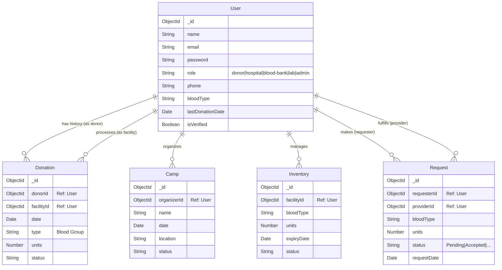

# Blood Donation Management System (BDMS) - Project Details

## 1. Project Overview
The Blood Donation Management System (BDMS) is a web-based application designed to streamline the process of blood donation, inventory management, and blood requests between donors, hospitals, blood banks, and diagnostic labs. It aims to bridge the gap between donors and recipients by providing a centralized platform for managing blood camps, tracking donations, and facilitating emergency blood requests.

## 2. Key Features

### By User Role:

#### **Admin**
- **Dashboard**: Overview of system statistics (users, donations, requests).
- **User Management**: Verify and manage Hospitals, Blood Banks, and Labs.
- **Camp Management**: Oversee and schedule blood donation camps.
- **Donation Management**: View and manage donation records.
- **Reporting**: Access to system-wide data.

#### **Donor**
- **Dashboard**: View personal donation history and stats.
- **Profile**: Manage personal details (weight, age, blood type).
- **History**: specific list of past donations.
- **Camps**: View upcoming blood donation camps.

#### **Hospital**
- **Inventory Management**: Track blood stock levels.
- **Blood Requests**: Request blood units from other facilities (Blood Banks/Hospitals).
- **Request Status**: unique lifecycle (Pending -> Accepted/Rejected -> Completed).
- **Dashboard**: View requests and inventory statuses.

#### **Blood Bank / Lab**
- **Camp Management**: Organize and update status of blood camps.
- **Donation Processing**: Record new donations from donors.
- **Inventory Management**: specific blood stock management.
- **Request Fulfillment**: Respond to blood requests from hospitals.

## 3. Technical Architecture
- **Frontend**: Next.js (React) with App Router.
- **Backend**: Next.js API Routes (Serverless functions).
- **Database**: MongoDB (likely using Atlas) with Mongoose ODM.
- **Authentication**: Custom JWT-based authentication with role-based access control (RBAC).
- **Styling**: assumed CSS Modules / Tailwind (based on file structure).

## 4. System Diagrams

### 4.1. Use Case Diagram (Mermaid)
```mermaid
usecaseDiagram
    actor Admin
    actor Donor
    actor Hospital
    actor BloodBank as "Blood Bank/Lab"

    package "Auth System" {
        usecase "Login/Register" as UC1
        usecase "Manage Profile" as UC2
    }

    package "Donations & Camps" {
        usecase "View Camps" as UC3
        usecase "Manage Camps" as UC4
        usecase "Record Donation" as UC5
        usecase "View Donation History" as UC6
    }

    package "Inventory & Requests" {
        usecase "Manage Inventory" as UC7
        usecase "Request Blood" as UC8
        usecase "Fulfill Request" as UC9
    }

    Admin --> UC1
    Admin --> UC4
    Admin --> UC6
    Admin --> UC2

    Donor --> UC1
    Donor --> UC3
    Donor --> UC6
    Donor --> UC2

    Hospital --> UC1
    Hospital --> UC2
    Hospital --> UC7
    Hospital --> UC8
    Hospital --> UC6

    BloodBank --> UC1
    BloodBank --> UC2
    BloodBank --> UC4
    BloodBank --> UC5
    BloodBank --> UC7
    BloodBank --> UC9
```

### 4.2. Data Flow Diagram (DFD - Level 1)
```mermaid
graph TD
    User[User (Donor/Admin/Hospital/Bank)]
    AuthProcess(Authentication Process)
    DonationProcess(Donation Processing)
    RequestProcess(Request Management)
    InventoryProcess(Inventory Management)
    
    DB_Users[(Users Database)]
    DB_Donations[(Donations Database)]
    DB_Requests[(Requests Database)]
    DB_Inventory[(Inventory Database)]
    DB_Camps[(Camps Database)]

    %% Auth Flow
    User -->|Login/Register Credentials| AuthProcess
    AuthProcess -->|Verify/Store| DB_Users
    DB_Users -->|User Profile/Token| AuthProcess
    AuthProcess -->|Session Token| User

    %% Donation Flow
    User -->|Donation Details| DonationProcess
    DonationProcess -->|Save Record| DB_Donations
    DonationProcess -->|Update Last Donation| DB_Users
    DonationProcess -->|Update Stock| InventoryProcess
    
    %% Request Flow
    User -->|Create Request| RequestProcess
    RequestProcess -->|Save Request| DB_Requests
    RequestProcess -->|Notify Provider| User
    RequestProcess -->|Update Status| DB_Requests
    
    %% Inventory Flow
    User -->|Update Stock| InventoryProcess
    InventoryProcess -->|Save Stock Level| DB_Inventory
    DB_Inventory -->|Stock Data| InventoryProcess
    InventoryProcess -->|Stock Status| User
```

### 4.3. Entity Relationship Diagram (ERD)

